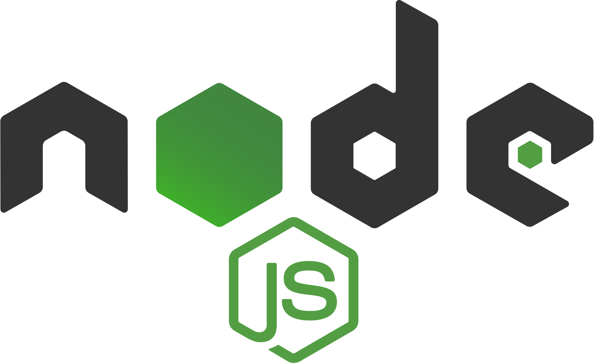
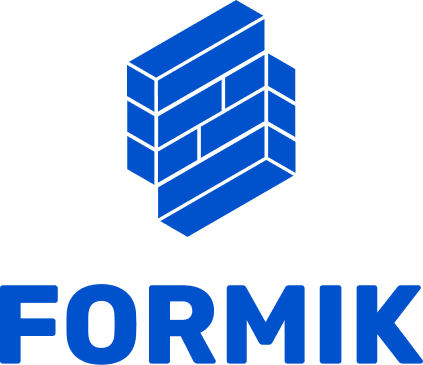

<h1>Movie Quotes</h1>

Movie Quotes is a social network where you can find any quote in millions of movie lines.

#

## Table of Contents

- [Table of Contents](#table-of-contents)
- [Prerequisites](#prerequisites)
- [Tech Stack](#tech-stack)
- [Getting Started](#getting-started)
- [Project Structure](#project-structure)
- [Resources](#resources)

## Prerequisites

-  <p>_Node JS @12.X and up_</p>
-  <p>_npm @6 and up_</p>

#

## Tech Stack

-  <p><a href="https://nextjs.org/" target="_blank">[NextJs @12.2.3]</a> - The React Framework for Production<p/>

-  <p><a href="https://www.typescriptlang.org/" target="_blank">[Typescript @4.7.4]</a> - JavaScript with syntax for types.TypeScript is JavaScript with syntax for types<p/>

-  <p><a href="https://tailwindcss.com/" target="_blank">[tailwindcss @3.1.3]</a> - CSS framework<p/>

-  <p><a href="https://axios-http.com/" target="_blank">[axios @0.27.2]</a> - Promise based HTTP client for the browser and node.js<p/>

-  <p><a href="https://formik.org/" target="_blank">[formik @2.2.9]</a> - Open source form library for React and React Native<p/>

-  <p><a href="https://next-auth.js.org/" target="_blank">[next-auth @4.10.2]</a> - Authentication for Next.js<p/>

-  <p><a href="https://www.npmjs.com/package/next-i18next" target="_blank">[next-i18next @11.3.0]</a> - Translate Next.js apps<p/>

-  <p><a href="https://socket.io/" target="_blank">[socket.io-client @4.5.1]</a> - Bidirectional and low-latency communication for every platform<p/>

- <p><a href="https://www.npmjs.com/package/yup" target="_blank">yup @0.32.11</a> - Schema builder for value parsing and validation<p/>

- <p><a href="https://www.npmjs.com/package/react-infinite-scroll-component" target="_blank">react-infinite-scroll-component @6.1.0</a> - A component to make all your infinite scrolling woes go away<p/>

- <p><a href="https://react-select.com/home" target="_blank">react-select @5.4.0</a> - Select Input control for ReactJS<p/>

- <p><a href="https://www.npmjs.com/package/react-drag-drop-files" target="_blank">react-drag-drop-files @2.3.7</a> - ReactJs drag and drop files library<p/>

#

## Getting Started

1\. First of all you need to clone repository from github:

```sh
git clone https://github.com/Saba-Var/movie-quotes-front-Var-saba.git
```

2\. Navigate to the repository

```sh
cd movie-quotes-front-Var-saba/
```

3\. Next step requires install all the dependencies

```sh
npm install
```

or

```sh
yarn install
```

4\. copy .env

```sh
cp .env.example .env
```

5\. after that you can run application from terminal:

```sh
npm run dev
```

Runs the app in the development mode. Open http://localhost:3000 to view it in your browser.

#

## Project Structure

```bash
├─── .github
│     └── workflows
├─── readme
├─── components
│     ├── component-group-folder
│     │    ├── individual-component-folder
│     │    │    ├── component-file.tsx
│     │    │    ├── index.ts
│     │    │    ├── types.d.ts [#OPTIONAL]
│     │    │    └── costum-hook.tsx [#OPTIONAL]
│     │    └── index.ts
│     └── index.ts
├─── context
│     ├── socket.context.tsx
│     ├── types.d.ts
│     └── index.ts
├─── helpers
│     ├── helper-file.ts
│     ├── types.d.ts
│     └── index.ts
├─── hooks
│     ├── hook-file.ts
│     └── index.ts
├─── pages
│     ├── api
│     ├── page-folder
│     │    ├── index.tsx
│     │    └── [id].tsx [#OPTIONAL]
│     ├── _app.tsx
│     ├── 404.tsx
│     ├── index.tsx
│     └── index.unauthorized.tsx
├─── public
│     ├── assets
│     │    ├── fonts
│     │    └── images
│     ├── locales
│     │    ├── en
│     │    └── ge
│     ├── favicon.ico
│     └── index.tsx
├─── readme
│     └── assets
├─── schemas
│     ├── form.ts
│     └── index.ts
├─── services
│     ├── service-file.ts
│     ├── axios.ts
│     ├── types.d.ts
│     └── index.ts
├─── styles
│     └── global.css
├─── types
│     ├── global.d.ts
│     └── index.ts
│- .env
│- .env.example
│- .eslintrc.json
│- .gitignore
│- .prettierrc.json
│- next-env.d.ts
│- next-i18next.config.js
│- next.config.js
│- package.json
│- postcss.config.js
│- README.md
│- tailwind.config.js
│- tsconfig.json


```

#

## Resources

- [Application Details](https://redberry.gitbook.io/assignment-iv-movie-quotes-1/)
- [Application Design [Figma]](https://www.figma.com/file/5uMXCg3itJwpzh9cVIK3hA/Movie-Quotes-Bootcamp-assignment?node-id=0%3A1)
- [Application Design Prototype](https://www.figma.com/proto/5uMXCg3itJwpzh9cVIK3hA/Movie-Quotes-Bootcamp-assignment?node-id=0%3A1&scaling=scale-down&page-id=0%3A1&starting-point-node-id=337%3A29589&show-proto-sidebar=1)
- [Git commit rules](https://redberry.gitbook.io/resources/git-is-semantikuri-komitebi)
